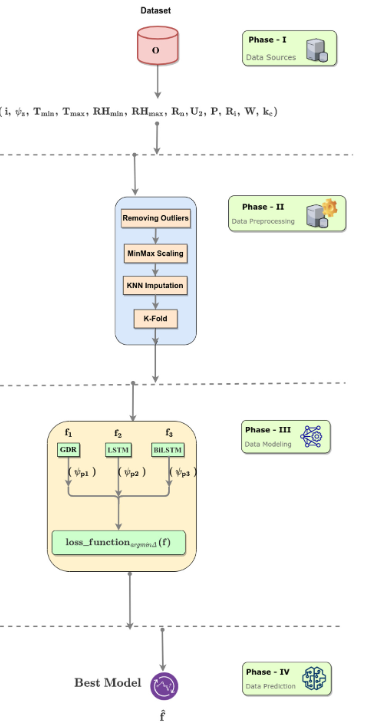
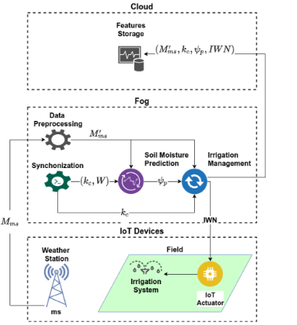

# Smart Farming Fog DNN

<p>
  
  
  
  
  
</p>

A compact, notebook-centered repository for studying **soil matric potential prediction** and **fog-enabled intelligent irrigation** using deep neural networks.

The project is based on the article:

> **Matheus Cordeiro**, Catherine Markert, Sayonara S. Araújo, Nídia G. S. Campos, Rubens S. Gondim, Ticiana L. Coelho da Silva, and Atslands R. da Rocha.  
> **Towards Smart Farming: Fog-enabled intelligent irrigation system using deep neural networks.**  
> *Future Generation Computer Systems*, Volume 129, pages 115–124, 2022.  
> [DOI: 10.1016/j.future.2021.11.013](https://doi.org/10.1016/j.future.2021.11.013)

This repository is maintained by [Matheus Cordeiro](https://github.com/fobos123deimos), the first author listed in the associated publication.

---

## 🌱 Project Overview

Agricultural irrigation requires reliable information about the amount of water retained in the soil.

Soil moisture can be monitored using tensiometers installed at different depths. However, sensor malfunction and connectivity problems may generate missing observations or prevent the irrigation management system from receiving soil information.

This project investigates whether deep learning models can estimate the **soil matric potential** using information related to:

- weather conditions;
- crop development;
- previous irrigation;
- rainfall;
- soil monitoring;
- historical measurements.

The predicted matric potential can then support the calculation of the **Irrigation Water Need**, or IWN, even when soil sensors are temporarily unavailable.

<p align="center">
  
</p>

---

## 📓 Notebook

The repository is centered on a single, self-contained notebook:

```text
smart_farming_fog_dnn.ipynb
```

The notebook contains the complete experimental workflow, including:

- scientific context and article summary;
- mathematical formulation of the prediction problem;
- soil-water retention concepts;
- data loading and inspection;
- domain-based outlier filtering;
- MinMax normalization;
- KNN missing-value imputation;
- cross-validation without test-data leakage;
- GDR-inspired dense regression;
- Long Short-Term Memory networks;
- Bidirectional LSTM networks;
- evaluation using Mean Absolute Error;
- comparison with published results;
- training of a final prediction model;
- TensorFlow Lite conversion;
- fog-node deployment guidance.

<p align="center">
  <a href="smart_farming_fog_dnn.ipynb">
    
  </a>

  <a href="https://colab.research.google.com/github/fobos123deimos/smart-farming-fog-dnn/blob/main/smart_farming_fog_dnn.ipynb">
    
  </a>
</p>

---

## 📂 Repository Structure

```text
smart-farming-fog-dnn/
├── README.md
├── smart_farming_fog_dnn.ipynb
└── images/
    ├── deep_learning_framework.png
    └── fog_irrigation_architecture.png
```

The repository is intentionally simple.

All preprocessing functions, equations, neural architectures, evaluation routines, and export logic are contained directly in the notebook.

---

## 🌦️ Input Variables

A historical observation can be represented as:

$$
o_t =
\left(
i,
\psi_z,
T_{\min},
T_{\max},
RH_{\min},
RH_{\max},
R_n,
U_2,
P,
R_i,
W,
k_c
\right)
$$

where:

| Variable | Description |
|---|---|
| $i$ | Soil monitoring location |
| $\psi_z$ | Soil matric potential at depth $z$ |
| $T_{\min}$ | Minimum air temperature |
| $T_{\max}$ | Maximum air temperature |
| $RH_{\min}$ | Minimum relative humidity |
| $RH_{\max}$ | Maximum relative humidity |
| $R_n$ | Net radiation |
| $U_2$ | Wind speed |
| $P$ | Atmospheric pressure |
| $R_i$ | Rainfall |
| $W$ | Amount of water provided to the crop |
| $k_c$ | Crop coefficient |

The objective is to learn a predictive function:

$$
\hat{\psi}_z =
f\left(
i,
T_{\min},
T_{\max},
RH_{\min},
RH_{\max},
R_n,
U_2,
P,
R_i,
W,
k_c
\right)
$$

The optimal function can be represented as:

$$
\hat{f}
=
\operatorname*{arg\,min}_{f \in \mathcal{H}}
\Delta(f)
$$

where $\mathcal{H}$ is the set of candidate predictive models and $\Delta$ is the selected loss function.

---

## 🔄 Scientific Workflow

The methodology is divided into four phases.

### Phase I — Data Sources

The dataset combines historical information from:

```text
weather stations
soil tensiometers
irrigation records
crop development records
```

The original experiments used data from experimental cashew and coconut fields located at Embrapa in Paraipaba, Ceará, Brazil.

Soil matric potential was monitored at three depths:

```text
15 cm
45 cm
75 cm
```

---

### Phase II — Data Preprocessing

The preprocessing stage includes:

```text
removing domain-based outliers
separating training and test folds
KNN missing-value imputation
MinMax feature scaling
target scaling
K-fold cross-validation
```

The notebook fits the imputer and scalers using only the training data from each fold. This prevents information from the validation fold from leaking into model training.

#### MinMax Scaling

Each feature is transformed into the interval $[0,1]$:

$$
X_{\text{scaled}}
=
\frac{
X_{\text{original}}-\min(X_{\text{train}})
}{
\max(X_{\text{train}})-\min(X_{\text{train}})
}
$$

The inverse transformation is:

$$
X_{\text{original}}
=
X_{\text{scaled}}
\left[
\max(X_{\text{train}})-\min(X_{\text{train}})
\right]
+
\min(X_{\text{train}})
$$

#### KNN Imputation

Missing values are estimated using neighboring observations.

The Euclidean distance between observations $\mathbf{x}$ and $\mathbf{y}$ is:

$$
d(\mathbf{x},\mathbf{y})
=
\sqrt{
\sum_{j=1}^{p}
\left(
x_j-y_j
\right)^2
}
$$

Only the available features shared by the compared observations are considered during neighborhood construction.

---

### Phase III — Data Modeling

Three model families are studied.

#### GDR-Inspired Dense Regression

The dense model uses fully connected layers and a Gaussian activation function:

$$
\phi(x)=e^{-x^2}
$$

This model provides a non-recurrent baseline for comparison with the sequence-oriented architectures.

#### Long Short-Term Memory

The LSTM architecture is designed to model dependencies between input variables and historical observations.

The input gate is:

$$
\mathbf{i}_t
=
\sigma
\left(
W_i\mathbf{x}_t
+
U_i\mathbf{h}_{t-1}
+
\mathbf{b}_i
\right)
$$

The forget gate is:

$$
\mathbf{f}_t
=
\sigma
\left(
W_f\mathbf{x}_t
+
U_f\mathbf{h}_{t-1}
+
\mathbf{b}_f
\right)
$$

The output gate is:

$$
\mathbf{o}_t
=
\sigma
\left(
W_o\mathbf{x}_t
+
U_o\mathbf{h}_{t-1}
+
\mathbf{b}_o
\right)
$$

The candidate cell state is:

$$
\tilde{\mathbf{c}}_t
=
\tanh
\left(
W_c\mathbf{x}_t
+
U_c\mathbf{h}_{t-1}
+
\mathbf{b}_c
\right)
$$

The cell state is updated by:

$$
\mathbf{c}_t
=
\mathbf{f}_t
\odot
\mathbf{c}_{t-1}
+
\mathbf{i}_t
\odot
\tilde{\mathbf{c}}_t
$$

The hidden state is:

$$
\mathbf{h}_t
=
\mathbf{o}_t
\odot
\tanh
\left(
\mathbf{c}_t
\right)
$$

#### Bidirectional LSTM

BiLSTM processes the input in forward and backward directions:

$$
\overrightarrow{\mathbf{h}}_t
=
\operatorname{LSTM}_{f}
\left(
\mathbf{x}_t,
\overrightarrow{\mathbf{h}}_{t-1}
\right)
$$

$$
\overleftarrow{\mathbf{h}}_t
=
\operatorname{LSTM}_{b}
\left(
\mathbf{x}_t,
\overleftarrow{\mathbf{h}}_{t+1}
\right)
$$

The two representations are combined as:

$$
\mathbf{h}_t^{\mathrm{bi}}
=
\left[
\overrightarrow{\mathbf{h}}_t;
\overleftarrow{\mathbf{h}}_t
\right]
$$

---

### Phase IV — Data Prediction

After comparing the candidate models, the selected architecture can be used to estimate soil matric potential.

The predicted value can support irrigation management:

$$
\hat{\psi}_z
\longrightarrow
\text{soil moisture estimation}
\longrightarrow
\text{Irrigation Water Need}
$$

---

## 📏 Evaluation Metric

The main prediction metric is the Mean Absolute Error:

$$
\operatorname{MAE}
=
\frac{1}{n}
\sum_{i=1}^{n}
\left|
y_i-\hat{y}_i
\right|
$$

Because the target is normalized during training, the notebook converts the error back to the original scale:

$$
\operatorname{MAE}_{\text{original}}
=
\left[
\max(Y)-\min(Y)
\right]
\operatorname{MAE}_{\text{scaled}}
$$

The final error is reported in **kilopascals**, or kPa.

---

## 📊 Published Experimental Results

### Coconut Dataset

The published MAE results were:

| Model | 15 cm | 45 cm | 75 cm |
|---|---:|---:|---:|
| GDR test 1 | 7.1 | 6.0 | 6.5 |
| GDR test 2 | 7.7 | 7.0 | 7.3 |
| GDR test 3 | 6.5 | 5.5 | 6.0 |
| LSTM | 6.3 | 5.4 | 5.7 |
| BiLSTM | 6.2 | 5.4 | 5.9 |

The **LSTM** architecture obtained the lowest global average standard deviation among the evaluated coconut models.

---

### Cashew Dataset

The published MAE results were:

| Model | 15 cm | 45 cm | 75 cm |
|---|---:|---:|---:|
| GDR 1 | 25.41 | 22.60 | 18.98 |
| GDR 2 | 21.08 | 22.22 | 17.29 |
| LSTM | 23.52 | 18.89 | 16.89 |
| BiLSTM | 22.91 | 21.60 | 17.14 |

Considering the prediction behavior across the evaluated depths, the article selected **BiLSTM** as the best overall architecture for the cashew dataset.

Predictions were generally more accurate at deeper layers. The 15 cm layer presented greater variability because it is more directly affected by evaporation and recent weather conditions.

---

## 💧 Irrigation Water Need

The predicted matric potential was also applied to irrigation management.

| Crop | Real matric potential | Predicted matric potential | Without matric potential |
|---|---:|---:|---:|
| Coconut | -19.576 mm | -21.594 mm | 1.320 mm |
| Cashew | -12.758 mm | -12.993 mm | 3.189 mm |

Without soil information, the water-balance method indicated that irrigation was necessary.

When real or predicted matric potential was included, the results indicated that the soil already contained sufficient water. This demonstrates how soil prediction can help avoid unnecessary irrigation.

---

## ☁️ Fog-Enabled Architecture

<p align="center">
  
</p>

The proposed decision-support architecture is divided into three levels.

### IoT Devices

```text
weather station
soil monitoring devices
irrigation system
IoT actuator
```

### Fog Layer

```text
data preprocessing
data synchronization
soil matric potential prediction
irrigation management
```

### Cloud Layer

```text
historical feature storage
crop information
predicted soil information
irrigation records
```

The fog node performs the prediction close to the monitored field, reducing dependency on continuous cloud connectivity and allowing irrigation decisions to be made with lower latency.

---

## 🍓 Fog-Node Deployment

The original models were converted to TensorFlow Lite and evaluated on a:

```text
Raspberry Pi 4 Model B
Broadcom BCM2711 processor
Quad-core 64-bit CPU
1.5 GHz
1 GB RAM
32 GB SD card
```

The published evaluation reported:

```text
maximum CPU increase: approximately 10%
RAM increase: less than 1%
```

These results indicate that the models can be executed on resource-constrained fog devices used in Internet of Things applications.

---

## 🗃️ Dataset

The original research datasets are not redistributed in this repository.

To execute the cashew experiments, place the following file beside the notebook:

```text
caju_data_new.csv
```

The expected data include variables such as:

```text
Data
T1-15
T1-45
T1-75
W1
Kc
T_min
T_max
RH_min
RH_max
Rn
U2
P
Ri_f
```

The notebook verifies that the required columns are present before training.

---

## ▶️ Running the Notebook

### Google Colab

Open the notebook using:

```text
https://colab.research.google.com/github/fobos123deimos/smart-farming-fog-dnn/blob/main/smart_farming_fog_dnn.ipynb
```

Upload `caju_data_new.csv` to the Colab session before executing the data-loading section.

### Local Environment

Clone the repository:

```bash
git clone https://github.com/fobos123deimos/smart-farming-fog-dnn.git
cd smart-farming-fog-dnn
```

Create a virtual environment:

```bash
python -m venv .venv
```

Activate it on Linux or macOS:

```bash
source .venv/bin/activate
```

Activate it on Windows:

```powershell
.venv\Scripts\activate
```

Install the main dependencies:

```bash
pip install jupyter pandas numpy matplotlib scikit-learn tensorflow
```

Start Jupyter:

```bash
jupyter notebook
```

Then open:

```text
smart_farming_fog_dnn.ipynb
```

---

## 🔁 Reproducibility Notes

The notebook is a modernized research implementation inspired by the original experimental code.

The revised workflow improves reproducibility by:

- keeping the complete experiment in one notebook;
- removing external helper-notebook dependencies;
- creating an independent neural model for each experiment;
- fitting imputers only on training folds;
- fitting scalers only on training folds;
- returning prediction errors to the original kPa scale;
- defining random seeds;
- documenting assumptions and required dataset columns;
- organizing the experiment into explicit scientific phases.

Exact numerical reproduction still depends on:

```text
access to the original datasets
software versions
hardware configuration
random initialization
training parameters
data-cleaning decisions
```

---

## 📚 Citation

When using this repository or the associated research, cite:

```bibtex
@article{cordeiro2022towards,
  title   = {Towards Smart Farming: Fog-enabled intelligent irrigation system using deep neural networks},
  author  = {
    Cordeiro, Matheus and
    Markert, Catherine and
    Araújo, Sayonara S. and
    Campos, Nídia G. S. and
    Gondim, Rubens S. and
    Coelho da Silva, Ticiana L. and
    da Rocha, Atslands R.
  },
  journal = {Future Generation Computer Systems},
  volume  = {129},
  pages   = {115--124},
  year    = {2022},
  doi     = {10.1016/j.future.2021.11.013}
}
```